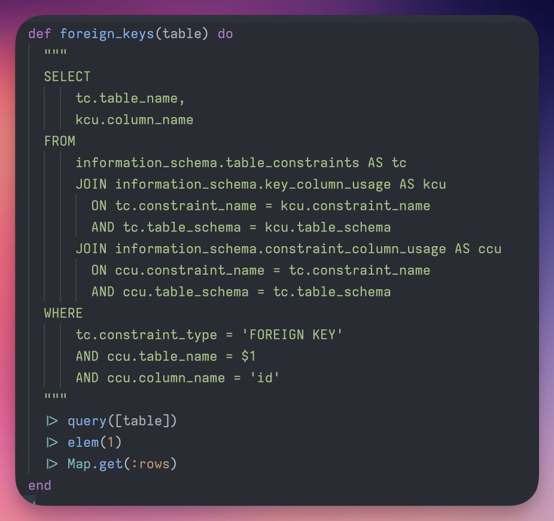

https://hexdocs.pm/ecto/Ecto.Query.html#module-named-bindings

https://github.com/michaelfich/ecto_jsonb_example/tree/main

https://github.com/elixir-dx/dx/blob/5adadc1d49196cbc127ba2d9513f4866bd41f050/lib/dx/ecto/query.ex#L231
https://github.com/glific/glific/blob/52544fd501fbe539dffefdb75f9fd814a4e89dc1/lib/glific/flows/broadcast.ex#L234

1. explain Named Bindings 
2. `parent_as(:post)` vs `^post_id`
3. subqueries / named bindings in subqueries - 

Bonus section -- building parent_associations for arbitrary schemas
https://github.com/RaghavSood/live_admin/blob/b44563a32db0f55032a3e5cc6920f184a5e2639d/lib/live_admin.ex#L59-L66

from: [Atom Kirk](https://x.com/atomkirk/status/1806693770919899244/photo/2)